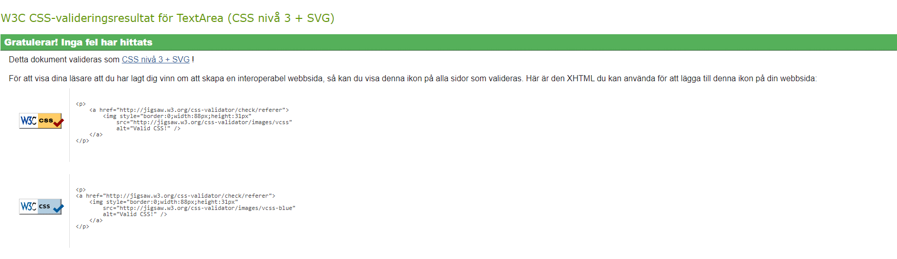
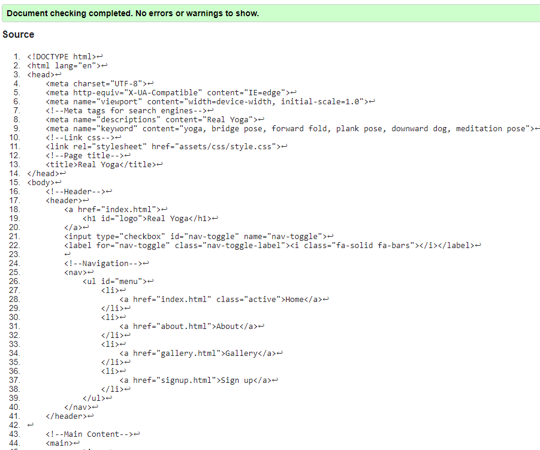
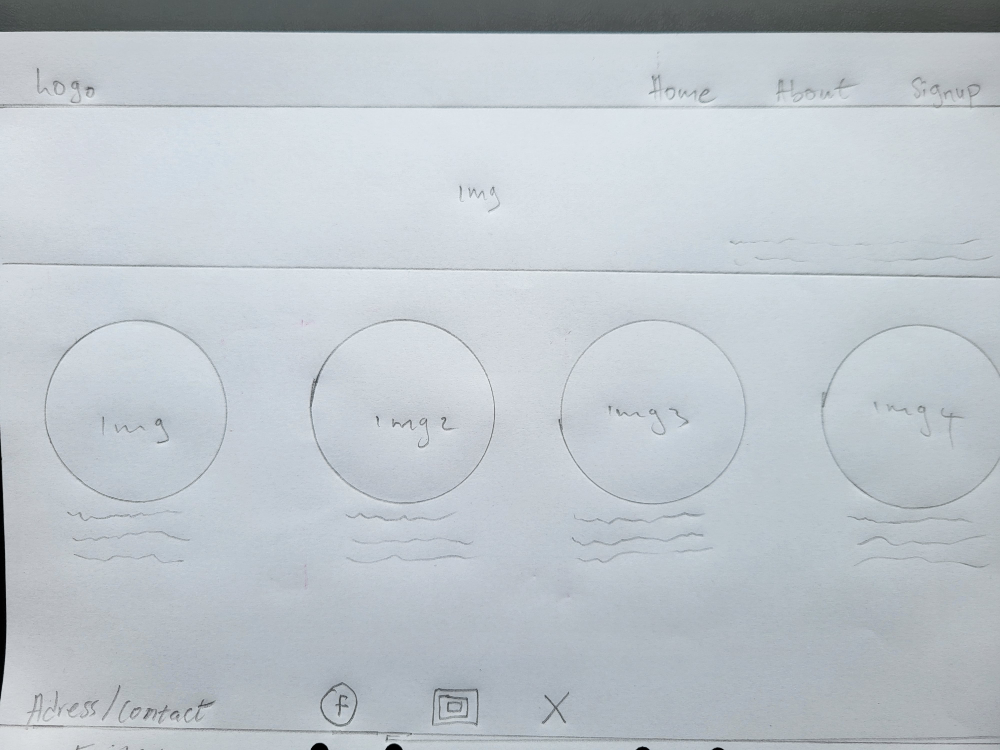
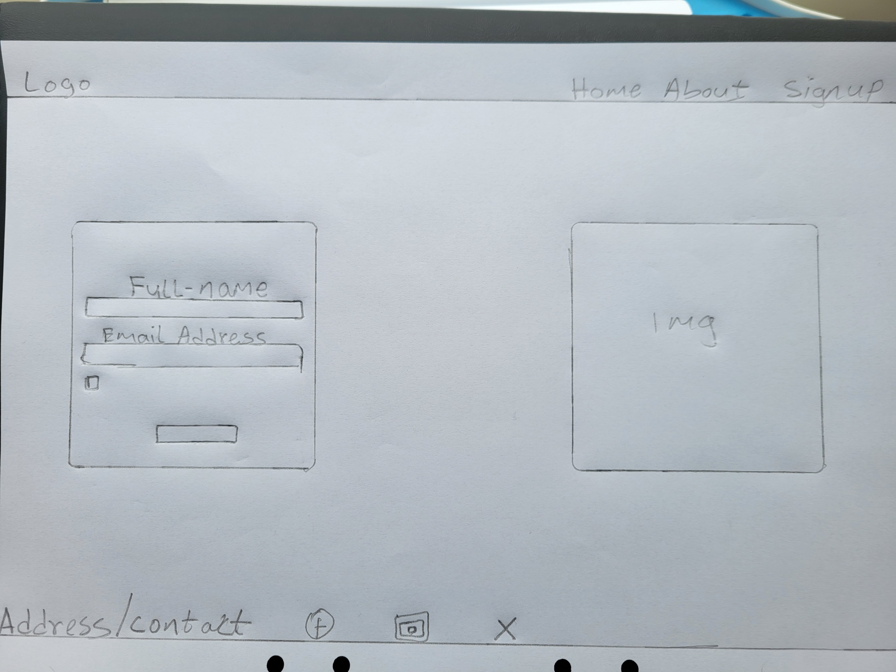
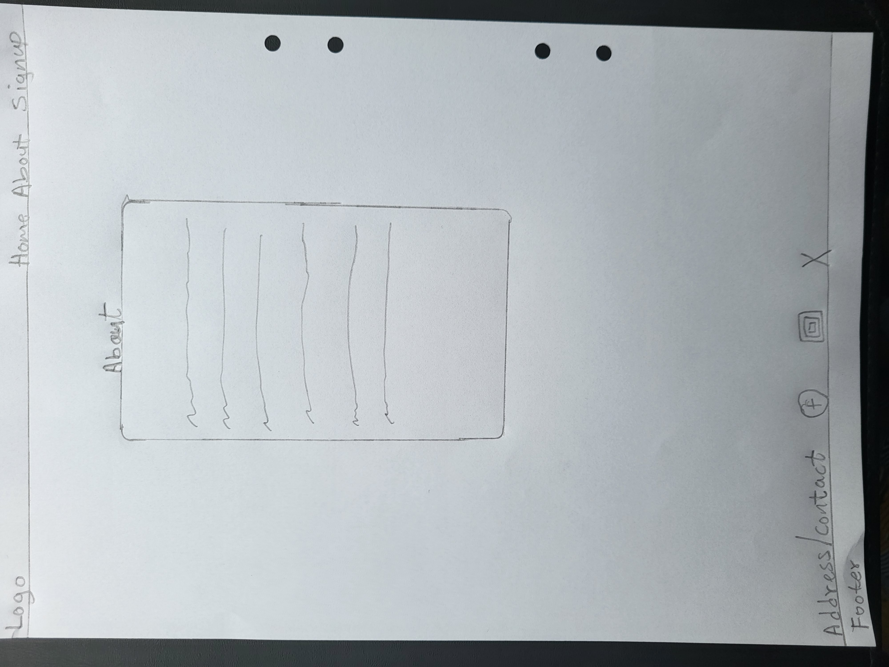

![Live page] (<https://madu-j.github.io/yogawithme/>)
# Purpose

# Real Yoga

is a platform where users will learn yoga to improve their health and feel happy. The webpage will have a signup form where any interested person can sign up for yoga training. Anyone who sign the form will get an acknowledgment email

The webpage will have "About" page for users to read about what the website stands for and its aim. There will be signup link included in all the pages to help interested user have easy click to the signup section.

User Experience Design
User Stories

## First Time Visitor Goal

.As a first-time user I want to easily understand what the site main purpose is all about.

. As first-time user I want to easily navigate throughout the website and find content about yoga exercise.

. As first-time user I use my phone often, so I want to view the website content clearly on my mobile.

. As a first-time user I found the site interesting and want to join the yoga class to improve my health.

## Returning Visitors Goals

. As a returning use I want to see different yoga pass and its benefits

.  As a returning user I want to join the yoga class.

. As a returning user I want to contact the site owner and share my health journey and result.

## Frequent Visitor Goal

. As a frequent user I want to see more yoga poses and its health benefits

. As a frequent user, I want to join the yoga class to improve my health and weight loss journey.

## Site structure

All pages contain a navigation menu at the top right side of the website. Users can easily move from one page to the other. The navigation menu collapses on mobile and show font icon of bars. This is done for the aim purpose of fulfilling user story:

| As first-time user I want to easily navigate throughout the website and find content.

The home page contains a full bio about the Web page to tell the user what the page is for and its aim. This is to fulfil the purpose of user story:

| I want to easily understand what the site main purpose is.

CSS Media query is used to make the website responsive.

All pages are responsible and the layout changes depending on the user screen size. This is to ensure content flow is applied and images are displayed properly. The website doesn't shrink side by side that it becomes unreadable in small screen. This purpose is to fulfil user experience.

| As first-time user I use my phone often so I want to view the website content clearly on my mobile.

All pages contain a footer Element with social media icons for any user that wants contact the trainer. The user can send message through any of the social media platforms. The icons used is from font-awesome. This is to fulfil the sole purpose of user story:

| As a returning user I want to contact the site owner and share my health journey and result

The signup page will have form for users who wants to join yoga class. This is to fulfil the sole purpose of user story:
| As a first-time user I found the site interested and want to join yoga class

| As a returning user I want to join the yoga class.

| As a frequent user I want to see more yoga poses and its health benefits

The About page will contain background information about the page owner and the mission statement of the page. This is for the purpose of user story:

| As a first-time user I want to easily understand what the site main purpose is.

The gallery page will contain photos of different yoga pose. This is for the purpose of user story:
| As a returning user I want to see different yoga pose and their benefits

| As a frequent user I want to see more content;

## Design

The site will use 3 colors dark green background, white for header and footer and white to make the text readable for all user.

## Typography

The header on all pages used Oswald, sans-serif while the body used Lota, sans-serif

## magery

All images and videos were gotten from Canva and accesses granted as a subscribed member on Canva

Features Left to Implement
Improve page performance to 100%.
Payment option for any user want to go futher after the one month free trial is exhausted.
Callender where users can book time for personal training

## Technologies

. ##HTML ... This project use HTML as the main language to complete the structure of the website.

## CSS

. This project will use CSS in styling the website. The CSS style.css will be created separately and linked to HTML.

## vFont Awesome

. Font awesome icons are used for the navbar and link contain in the header. Other font awesome icons are for social media platforms and links contains in the footer.

## Google Font

. Google fonts will be used throughout the whole project to import Lato Oswald and included sans-serif in case the Google font falls.

## GitHub

. GitHub will be the hosting site used to store the source code website and Git Pages is used for the deployment of the site.

## Git

. Git is used as version control software to commit and push code to the GitHub repository where the source code was stored. This will be done by using git add .
git commit -m "and the message that tells what I have done"

## Google Chrome Developer Tools

. Google Chrome developer tool will be used to inspect the page and help debug issues with the site layout and test different CSS styles

## CSS Generator

. This will be the tool used to convert the RGB and Hex colors for the site.

## Project Creation

. This project will be created using "Code Institute Full Template. <https://github.com/Code-Institute-Org/ci-full-template> This is done Under by creating  a new repository of Real Yoga. Under code a HTML link of Real Yoga was copied to clipboard and a new work space was created on app.codeanywhere using the GitHub link of Yoga With Me. During the project python3 -m http.server was used to open the and view the project on web browser.

. git add. and git commit -m and a message that explaining the updates. This command was used throughout the project to commit changes to the local repository.

Then git push command is used to push all committed work and changes to the GitHub repository.

Deployment
This project was deployed on navigating to the GitHub repository

1 Click the Settings tab

1. Scroll down on the left-hand side where the GitHub pages are
3 Make sure the Source is Deploy from a branch. The branch has to be set on main followed by root then click save
4 Click code at the top left-side to refresh the page and check down at the right-hand side after packages to see the active Deployments. Click on the GitHub-page and on the right side to open the browser. And this will take you the life project of Yoga With Me.

# Credits

All images and videos use on this project was taken from Canva and permission was obtained as a pro member of <www.canva.com/>
To love running web designer. The love running project helped in creating my page to be responsivive on all device

# Testing

The testing performed on the visual effects and layout of the Website. Testing was done on all the web browsers and all screen sizes.

All nav links should direct to the correct html pages as per their names. The Home page is the exception, this one will redirect to index.html.

All links to external websites must open in a new browser.

Testing of form validation will also be required to ensure the correct inputs are taken and that all fields are required.

Validation of inclusion for all features included in the Structure of the Website / Wireframes must be performed.

The Home page, About, Gallery and signup page was validated using WC3 HTML Validator <https://validator.w3.org/> and all the pages passed the validation process.
The css was validated using WCS CSS Validator (Jigsaw) <https://jigsaw.w3.org/css-validator/>
The website was also texting in lighthouse 

## Acknowlegdment 
I had challenge building the site because it kept crashing. At a pointed I started all over and and it kept crashing. The site pass validation when tested but when I put the link on am I responsive the website is showing crashed.

I want to acknowledge my mentor Mr Antonio Rodringuez for assistancing me in fixing the issue. He stepped all out of his schedule to assist and rebuild the page. I'm truly thankful for his help.

This is my skeleton plan for the page, but unfortnatly it crashed and I started all over.

